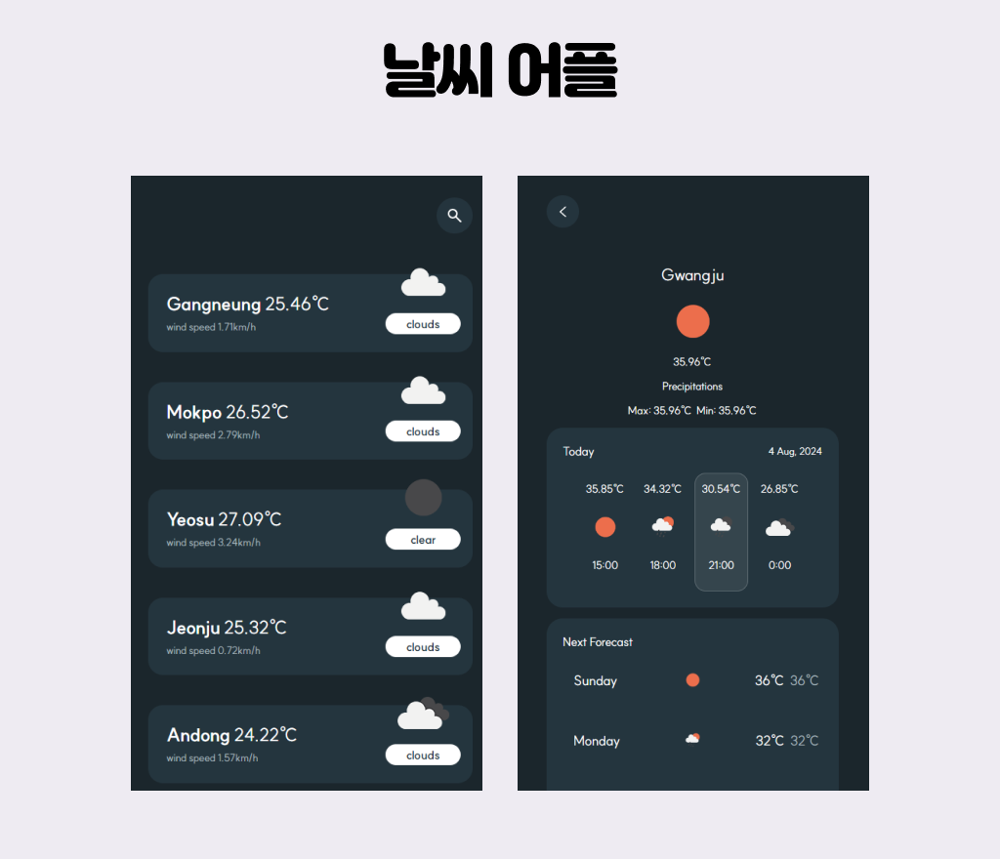

## 날씨보기 어플

### 프로젝트 소개

- OpenWeather API를 이용하여 모바일용 날씨 보기 어플을 만들었습니다. (참고사이트)
- 문서를 읽고 API를 통해 필요한 데이터를 불러오는 방식을 배웠습니다.
- 지역명을 입력하고 각 지역의 현재 날씨와 오늘날씨, 이번주 날씨를 불러왔습니다.
- Lodash 라이브러리의 _.shuffle을 사용하여 메인리스트의 도시 목록이 항상 섞여보이도록 만들었습니다.
- _.map, _.chain, _.include, _.shuffle를 사용하여 작업을 할 수 있었습니다.
- vue의 watch 훅을 사용하여 변경되는 도시 정보를 불러오게 했습니다.
- promise, async, await을 사용하여 도시 정보를 불러왔습니다. 

### 프로젝트 설명
- 작업기간 : 2024.04.22 - 2024.05.07
- 사용 언어: Vue.js, scss 사용

